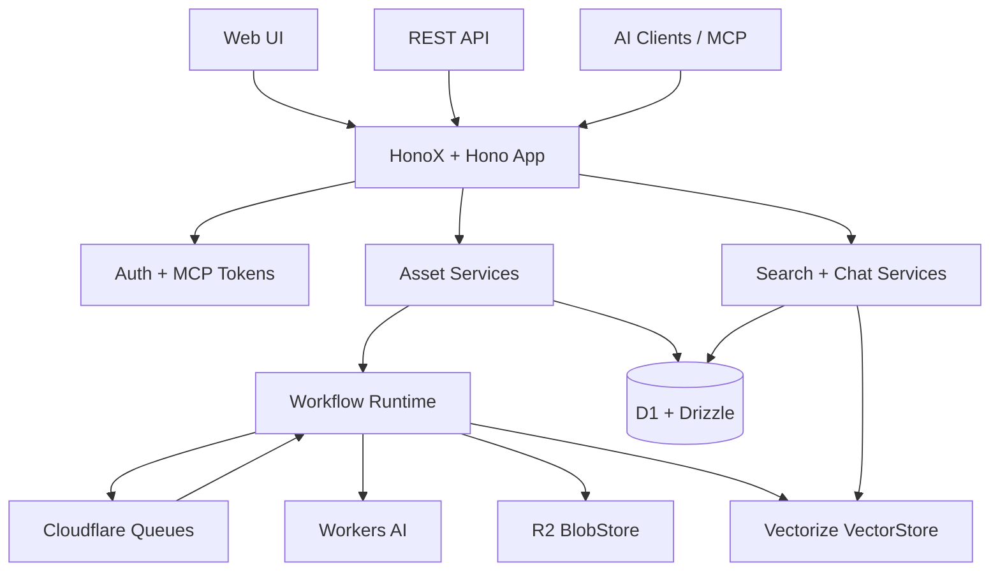

<p align="center">
  <br>
  <h1 align="center">CloudMind</h1>
  <p align="center">
    Open-source, Cloudflare-native personal AI memory for searchable,
    answerable, user-owned knowledge.
  </p>
  <p align="center">
    <a href="https://www.typescriptlang.org/">
      
    </a>
    <a href="https://hono.dev/">
      
    </a>
    <a href="https://developers.cloudflare.com/">
      
    </a>
    <a href="https://orm.drizzle.team/">
      
    </a>
    <a href="https://vitest.dev/">
      
    </a>
    <a href="https://biomejs.dev/">
      
    </a>
  </p>
  <p align="center">
    <a href="./README.md">English</a> |
    <a href="./README.zh-CN.md">简体中文</a>
  </p>
  <p align="center">
    <a href="#features">Features</a> .
    <a href="#why-cloudmind">Why CloudMind</a> .
    <a href="#architecture">Architecture</a> .
    <a href="#quick-start">Quick Start</a> .
    <a href="#deployment">Deployment</a> .
    <a href="#mcp-server">MCP Server</a>
  </p>
</p>

<p align="center">
  <a href="https://deploy.workers.cloudflare.com/?url=https://github.com/evepupil/CloudMind">
    
  </a>
</p>

---

## Overview

CloudMind is a BYOC (Bring Your Own Cloud) knowledge system for the AI era.
It helps you save URLs, notes, PDFs, browser captures, and AI-originated
content into your own Cloudflare account, then turns them into structured
assets that can be searched, cited, reprocessed, and used by AI clients.

The current project is a single HonoX full-stack application with a Web UI,
REST API, queue-driven processing workflows, and a stateless remote MCP server.
It uses Cloudflare D1, R2, Vectorize, Queues, and Workers AI by default while
keeping the core domain behind replaceable ports.

## Features

| Category | Highlights |
| --- | --- |
| Ingest | Save text notes, URLs, and PDF files through Web UI, REST APIs, and MCP tools |
| Processing | Workflow-based normalization, summarization, chunking, embedding, indexing, and finalization |
| Search | Hybrid retrieval with Vectorize semantic recall, D1 metadata filters, grouped evidence, and summary fallback |
| Chat | Library-grounded Q&A with source-aware responses |
| Asset Management | Asset list, detail pages, edit actions, soft delete, restore, reprocess, workflow history |
| MCP | Stateless HTTP MCP endpoint with retrieval-first tools for AI clients |
| Auth | Single-user login, password change, session middleware, MCP token management |
| Infrastructure | Cloudflare D1, R2, Vectorize, Queues, Workers AI, and optional Jina Reader integration |
| Tooling | Strict TypeScript, Zod validation, Drizzle ORM, Biome, Vitest |
| Deployment | Cloudflare deploy button, one-command resource bootstrap, and standard Wrangler deployment |

## Why CloudMind

| | CloudMind | Hosted knowledge SaaS |
| --- | --- | --- |
| Data ownership | Runs in your own Cloudflare account | Data lives with the vendor |
| Raw assets | Preserved for export and reprocessing | Export shape depends on platform support |
| AI memory | Exposed through Web UI, REST, and MCP | Often tied to one product surface |
| Infrastructure | Serverless-first, low-ops Cloudflare stack | Opaque hosted infrastructure |
| Migration path | Ports for repositories, blobs, vectors, queues, and AI providers | Migration depends on vendor APIs |
| Retrieval model | Semantic chunks, metadata terms, grouped evidence, source-aware Q&A | Usually hidden behind product UX |
| Extensibility | Feature-first TypeScript codebase | Extension points vary by product |

## Architecture



CloudMind keeps product logic separated from infrastructure details:

| Port | Default implementation |
| --- | --- |
| `AssetRepository` | Cloudflare D1 + Drizzle ORM |
| `WorkflowRepository` | Cloudflare D1 + Drizzle ORM |
| `BlobStore` | Cloudflare R2 |
| `VectorStore` | Cloudflare Vectorize |
| `JobQueue` | Cloudflare Queues |
| `AIProvider` | Cloudflare Workers AI |

This shape supports the current Cloudflare-native MVP and leaves room for
future PostgreSQL + pgvector, S3-compatible storage, and multi-provider AI.

## Processing Model

Assets move through type-specific workflows:

- `note_ingest_v1`
- `url_ingest_v1`
- `pdf_ingest_v1`

Typical workflow:

1. Create asset metadata.
2. Persist raw input.
3. Create a workflow run.
4. Normalize and persist clean content.
5. Generate summary and metadata terms.
6. Split content into chunks.
7. Create embeddings.
8. Write vectors and chunk metadata.
9. Finalize asset status.

Queue consumption is wired in [`app/server.ts`](./app/server.ts), and workflow
dispatch is registered in
[`src/features/workflows/server/registry.ts`](./src/features/workflows/server/registry.ts).

## Quick Start

```bash
git clone https://github.com/evepupil/CloudMind.git
cd CloudMind
npm install
npm run dev
```

The Vite development server starts at:

```text
http://localhost:5173
```

For a Cloudflare Worker-like local runtime, use:

```bash
npm run worker:dev
```

### Environment And Bindings

CloudMind reads Cloudflare bindings from [`wrangler.jsonc`](./wrangler.jsonc).
The application expects:

| Binding / Var | Purpose |
| --- | --- |
| `DB` | D1 database for assets, chunks, facets, jobs, auth, MCP tokens, and workflows |
| `ASSET_FILES` | R2 bucket for raw and processed asset content |
| `ASSET_VECTORS` | Vectorize index for asset chunks |
| `WORKFLOW_QUEUE` | Queue for async workflow execution |
| `AI` | Workers AI binding for summaries, classification, embeddings, and chat |
| `JWT_SECRET` | Session signing secret |
| `JINA_API_KEY` | Optional key for Jina Reader URL extraction |

Binding types live in [`src/env.ts`](./src/env.ts).

## Deployment

### Option A: Cloudflare Deploy Button

Use the deploy button at the top of this README, or open:

```text
https://deploy.workers.cloudflare.com/?url=https://github.com/evepupil/CloudMind
```

Cloudflare guides repository connection, resource provisioning, and deployment.

### Option B: One-Command Bootstrap

For a fresh Cloudflare account:

```bash
npm install
npm run deploy:one-click -- --prefix my-cloudmind
```

The script will:

- create D1, R2, Vectorize, and Queue resources
- update `wrangler.jsonc` bindings
- apply D1 migrations from `drizzle/`
- run the standard deployment pipeline

Bootstrap resources without deploying:

```bash
npm run deploy:bootstrap -- --prefix my-cloudmind
```

### Option C: Standard Wrangler Deploy

```bash
npm run build
npm run db:migrate:remote
npm run deploy
```

## Web Routes

| Route | Purpose |
| --- | --- |
| `/` | Home |
| `/login` | Sign in |
| `/change-password` | Change password |
| `/capture` | Save text, URL, or PDF assets |
| `/assets` | Asset list and management actions |
| `/assets/:id` | Asset detail, metadata, jobs, and content |
| `/assets/:id/workflows` | Workflow run history for one asset |
| `/search` | Semantic search UI |
| `/ask` | Library-grounded Q&A |
| `/mcp-tokens` | MCP token management |

## API Surface

### Ingest

- `POST /api/ingest/text`
- `POST /api/ingest/url`
- `POST /api/ingest/file`
- `POST /api/assets/:id/process`
- `POST /api/assets/backfill/chunks`

### Assets

- `GET /api/assets`
- `GET /api/assets/:id`
- `PATCH /api/assets/:id`
- `DELETE /api/assets/:id`
- `POST /api/assets/:id/restore`
- `GET /api/assets/:id/jobs`
- `GET /api/assets/:id/workflows`

### Workflows, Search, Chat, Health

- `GET /api/workflows/:id`
- `POST /api/search`
- `POST /api/chat`
- `GET /api/health`

## MCP Server

CloudMind exposes a stateless HTTP MCP server at:

```text
POST /mcp
```

Requests require a bearer token created from the `/mcp-tokens` page.
`GET /mcp` and `DELETE /mcp` return `405 Method not allowed`.

Available MCP tools:

| Tool | Purpose |
| --- | --- |
| `save_asset` | Save a text note or URL and trigger processing |
| `list_assets` | List assets with filters and pagination |
| `search_assets` | Run evidence-rich semantic retrieval |
| `search_assets_for_context` | Run retrieval with context-aware profiles |
| `get_asset` | Fetch one asset detail by ID |
| `update_asset` | Update title, summary, or source URL |
| `delete_asset` | Soft delete one asset |
| `restore_asset` | Restore a soft-deleted asset |
| `reprocess_asset` | Trigger asset reprocessing |
| `list_asset_workflows` | List workflow runs for one asset |
| `get_workflow_run` | Fetch workflow run detail with steps and artifacts |
| `ask_library` | Generate a quick grounded answer from the library |
| `ask_library_for_context` | Generate a context-profiled grounded answer |

Tool registration lives in
[`src/features/mcp/server/service.ts`](./src/features/mcp/server/service.ts),
and routing lives in
[`src/features/mcp/server/routes.ts`](./src/features/mcp/server/routes.ts).

## Example Requests

Create a text asset:

```bash
curl -X POST http://localhost:5173/api/ingest/text \
  -H "Content-Type: application/json" \
  -d '{
    "title": "Cloudflare Queues notes",
    "content": "Queues drive async workflow execution in CloudMind."
  }'
```

Run semantic search:

```bash
curl -X POST http://localhost:5173/api/search \
  -H "Content-Type: application/json" \
  -d '{
    "query": "queue-driven ingestion",
    "page": 1,
    "pageSize": 10
  }'
```

Ask the memory layer:

```bash
curl -X POST http://localhost:5173/api/chat \
  -H "Content-Type: application/json" \
  -d '{
    "question": "How does CloudMind process ingested content?",
    "topK": 5
  }'
```

## Project Structure

```text
app/
  routes/                         HonoX pages
  server.ts                       app entry and queue consumer
src/
  core/                           domain ports and contracts
  env.ts                          Cloudflare binding types
  features/
    assets/                       asset queries, editing, soft delete, restore
    auth/                         login, password, session middleware
    capture/                      ingest UI
    chat/                         grounded Q&A
    health/                       health endpoint
    ingest/                       ingest services, PDF extraction, AI enrichment
    layout/                       app shell components
    mcp/                          remote MCP server
    mcp-tokens/                   MCP token management
    search/                       retrieval, evidence, term search
    workflows/                    workflow runtime and definitions
  platform/
    ai/                           Workers AI adapter
    blob/                         R2 adapter
    db/                           D1 schema and repositories
    observability/                structured logger
    queue/                        Cloudflare Queue adapter
    vector/                       Vectorize adapter
    web/                          URL extraction adapters
drizzle/                          D1 migrations
docs/                             design notes and product direction
tests/unit/                       Vitest unit tests
```

## Scripts

```bash
npm run dev                 # Vite development server
npm run build               # Tailwind CSS build + Vite production build
npm run preview             # Preview production build
npm run worker:dev          # Wrangler local development
npm run worker:deploy       # Alias for deploy
npm run deploy              # Build, migrate remote D1, deploy Worker
npm run deploy:bootstrap    # Create Cloudflare resources and apply migrations
npm run deploy:one-click    # Bootstrap resources and deploy
npm run db:generate         # Generate Drizzle migrations
npm run db:migrate:remote   # Apply D1 migrations remotely
npm run typecheck           # TypeScript strict check
npm run lint                # Biome check
npm run format              # Biome format
npm run test                # Vitest unit tests
```

## Testing

The repository includes unit coverage for:

- ingest services, routes, content processing, and PDF extraction
- asset services and routes
- search services, routes, evidence, and term expansion
- chat services and routes
- MCP routes and tool-facing behavior
- workflow services and components
- D1 repositories
- Workers AI provider
- observability logger

Recommended verification before a pull request:

```bash
npm run typecheck
npm run lint
npm run test
```

## Design Principles

- Keep raw assets durable; derived AI output can be recomputed.
- Keep business logic behind ports instead of scattering D1, R2, Vectorize, or
  Workers AI details across features.
- Prefer queue-driven workflows for expensive processing.
- Validate external input with Zod at API and tool boundaries.
- Treat AI output as retryable, replaceable, and source-aware.
- Let retrieval degrade gracefully when some derived artifacts are missing.
- Keep feature code under `src/features/<feature>` and infrastructure adapters
  under `src/platform`.

## Roadmap

| Stage | Focus |
| --- | --- |
| v0.1 | URL, text, PDF ingest; workflows; summaries; tags; embeddings; search; asset detail |
| v0.2 | Stronger Q&A, MCP ergonomics, browser extension workflow, export, reprocessing |
| v0.3 | Better recommendations, richer metadata, multi-provider AI, migration readiness |

## Contributing

- Put new product modules under `src/features/<name>`.
- Keep infrastructure-specific code under `src/platform`.
- Use strict TypeScript and avoid `any`.
- Add focused tests when behavior crosses service, repository, API, or MCP
  boundaries.
- Run `npm run typecheck`, `npm run lint`, and `npm run test` before opening a
  pull request.

For deeper product and architecture constraints, see [`AGENTS.md`](./AGENTS.md).
