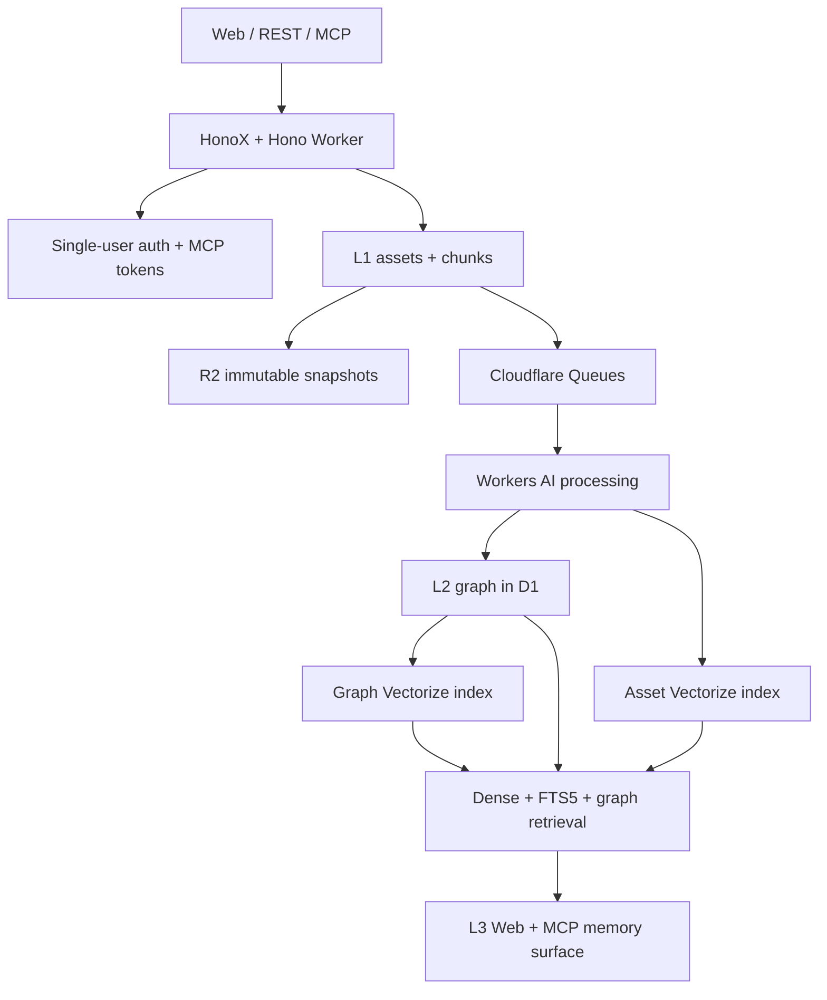

<p align="center">
  <br>
  <h1 align="center">CloudMind</h1>
  <p align="center">
    Open-source, user-owned AI memory on your own Cloudflare account.
  </p>
  <p align="center">
    <a href="https://www.typescriptlang.org/">
      
    </a>
    <a href="https://hono.dev/">
      
    </a>
    <a href="https://developers.cloudflare.com/">
      
    </a>
    <a href="https://github.com/evepupil/CloudMind/releases/tag/v0.3.0">
      
    </a>
    <a href="https://vitest.dev/">
      
    </a>
  </p>
  <p align="center">
    <a href="./README.md">English</a> |
    <a href="./README.zh-CN.md">简体中文</a>
  </p>
  <p align="center">
    <a href="#capabilities">Capabilities</a> ·
    <a href="#architecture">Architecture</a> ·
    <a href="#quick-start">Quick Start</a> ·
    <a href="#deployment">Deployment</a> ·
    <a href="#mcp-server">MCP Server</a> ·
    <a href="#data-sovereignty">Data Sovereignty</a>
  </p>
</p>

---

## Overview

CloudMind is a BYOC (Bring Your Own Cloud) personal AI memory layer. It runs
inside the user's Cloudflare account and keeps raw sources, structured memory,
search indexes, and exports under the user's control.

It can ingest URLs, notes, and PDFs; extract and reconcile knowledge; retrieve
evidence through lexical, semantic, and graph channels; and expose selective
personal or agent working memory to AI clients through MCP.

The current release is **v0.3.0**. Its roadmap milestones are complete and
covered by local gates, GitHub Actions, production smoke checks, and a Worker
rollback rehearsal.

## Memory Model

CloudMind uses three layers:

| Layer | Responsibility |
| --- | --- |
| L1 Source | Immutable assets, chunks, and R2 snapshots; the exportable source of truth |
| L2 Semantic Memory | D1 knowledge graph with entities, bi-temporal statements, edges, provenance, and optional communities |
| L3 Memory Surface | Web management and MCP verbs for remember, recall, update, forget, and restore |

Every record also carries three composable dimensions:

```text
recordKind = library | memory
scopeId    = personal | agent
contextKey = global | project:<stable-key>
```

These dimensions keep record shape, memory owner, and project context
independent. Filters use OR within one dimension and AND across dimensions.

CloudMind does not automatically archive complete external conversations.
AI clients write selected, high-density memory through `remember_agent`; users
can explicitly archive a complete source or conversation as a library asset.

## Capabilities

| Area | Current capability |
| --- | --- |
| Ingest | Save text, URLs, and PDFs through Web, REST, or MCP |
| Processing | Queue-driven normalization, summarization, chunking, embedding, entity extraction, and reconciliation |
| Retrieval | Dense Vectorize recall, D1 FTS5/BM25, graph recall, RRF fusion, Workers AI reranking, and MMR |
| Memory | Personal and agent memory, global/project context, date filters, version history, and provenance |
| Lifecycle | Dedicated update, soft forget, restore, confirmed hard delete, and cross-storage cleanup |
| Web | Observatory workspace, library, search, ask, graph, timeline, consolidation, activity, and Agent Memory management |
| Data sovereignty | Immutable raw snapshots, checksummed full export, offline validation, and fresh-resource restore |
| Release | SemVer, changelog gate, remote migration verification, production smoke, automatic rollback, and rehearsal |
| Auth | Single-user login, forced first password change, session middleware, and MCP token management |

## Architecture


```mermaid
flowchart TD
    Sources["Web / REST / MCP"] --> App["HonoX + Hono Worker"]
    App --> Auth["Single-user auth + MCP tokens"]
    App --> L1["L1 assets + chunks"]
    L1 --> R2["R2 immutable snapshots"]
    L1 --> Queue["Cloudflare Queues"]
    Queue --> AI["Workers AI processing"]
    AI --> L2["L2 graph in D1"]
    AI --> AssetVectors["Asset Vectorize index"]
    L2 --> GraphVectors["Graph Vectorize index"]
    L2 --> Retrieval["Dense + FTS5 + graph retrieval"]
    AssetVectors --> Retrieval
    GraphVectors --> Retrieval
    Retrieval --> L3["L3 Web + MCP memory surface"]
```

The application is one HonoX full-stack project. Domain behavior stays behind
repository, blob, vector, queue, and AI provider ports so D1, R2, Vectorize,
Queues, and Workers AI can be replaced later.

## Processing Model

Assets enter type-specific workflows:

- `note_ingest_v1`
- `url_ingest_v1`
- `pdf_ingest_v1`

A typical run saves the immutable source, normalizes content, creates chunks,
embeds and indexes evidence, extracts graph candidates, reconciles current and
historical statements, and then marks the asset ready. A retry reuses the first
archived source instead of overwriting it.

## Requirements

- Node.js `>=24.18.0 <25`
- pnpm `10.21.0` through Corepack
- A Cloudflare account and Wrangler login for cloud deployment

## Quick Start

```bash
git clone https://github.com/evepupil/CloudMind.git
cd CloudMind
corepack enable
pnpm install
cp .dev.vars.example .dev.vars
```

Replace `JWT_SECRET` in `.dev.vars` with a long random value, then initialize
the local D1 database and start Vite:

```bash
pnpm exec wrangler d1 migrations apply DB --local
pnpm dev
```

The default development URL is `http://localhost:5173`.

To run through Wrangler's Worker runtime:

```bash
pnpm build
pnpm worker:dev
```

## Environment And Bindings

| Binding / Var | Purpose |
| --- | --- |
| `DB` | D1 metadata, auth, workflows, memory versions, graph, and audit data |
| `ASSET_FILES` | R2 raw and processed source objects |
| `ASSET_VECTORS` | Vectorize index for asset chunks |
| `GRAPH_VECTORS` | Vectorize index for entity and graph recall |
| `WORKFLOW_QUEUE` | Queue for asynchronous ingest workflows |
| `AI` | Workers AI for generation, embedding, extraction, and reranking |
| `JWT_SECRET` | Required session-signing secret |
| `JINA_API_KEY` | Optional Jina Reader key for URL extraction |

Wrangler-generated binding types live in `worker-configuration.d.ts`; optional
application variables are added in [`src/env.ts`](./src/env.ts).

## Deployment

### Fresh Cloudflare Account

The bootstrap script creates account-specific D1, R2, two Vectorize indexes,
metadata indexes, Queue resources, and bindings before the first Worker deploy:

```bash
pnpm install
pnpm exec wrangler login
pnpm deploy:one-click -- --prefix my-cloudmind
pnpm exec wrangler secret put JWT_SECRET
```

The first deployment skips production smoke because a public URL may not exist
yet. After assigning a `workers.dev` or custom-domain URL, run:

```bash
SMOKE_BASE_URL=https://your-cloudmind.example.com pnpm release:smoke
```

Sign in with the one-time default credentials `admin / admin`; CloudMind forces
an immediate password change.

The generic Cloudflare Deploy Button is intentionally not the fresh-account
path. CloudMind requires account-specific storage resources, metadata indexes,
and a required secret, all of which are created explicitly by the bootstrap
script.

### Existing Deployment

`pnpm deploy` builds the application and then runs the verified release chain:

```text
remote D1 migrations
  -> exact migration verification
  -> Worker deploy
  -> production health, login, and MCP-auth smoke
  -> automatic Worker rollback when post-deploy smoke fails
```

Bash:

```bash
SMOKE_BASE_URL=https://cloudmind.example.com pnpm deploy
```

PowerShell:

```powershell
$env:SMOKE_BASE_URL='https://cloudmind.example.com'
try {
  pnpm deploy
} finally {
  Remove-Item Env:SMOKE_BASE_URL -ErrorAction SilentlyContinue
}
```

D1 migrations only move forward. Schema changes must remain compatible with
the previous Worker version. See the
[`Release and Rollback Runbook`](./docs/runbooks/发布与回滚.md).

## Web Routes

| Route | Purpose |
| --- | --- |
| `/` | Observatory overview |
| `/capture` | Save text, URL, or PDF sources |
| `/assets` | Library list and management |
| `/assets/:id` | Asset detail, provenance, content, and workflow state |
| `/assets/:id/workflows` | Workflow history for one asset |
| `/search` | Hybrid retrieval UI |
| `/ask` | Source-aware library Q&A |
| `/memory/agent` | Agent memory filters, projects, and lifecycle management |
| `/memory/agent/:id` | Agent memory detail and version history |
| `/memory/graph` | Knowledge graph view |
| `/memory/timeline` | Time-oriented memory view |
| `/memory/consolidation` | Consolidation and maintenance view |
| `/activity` | Processing and system activity |
| `/mcp-tokens` | MCP token management |
| `/login`, `/change-password` | Single-user authentication |

## API Surface

| Area | Endpoints |
| --- | --- |
| Ingest | `POST /api/ingest/text`, `/url`, `/file`; `POST /api/assets/:id/process` |
| Assets | `GET /api/assets`, `GET/PATCH/DELETE /api/assets/:id`, restore, jobs, and workflows |
| Retrieval | `POST /api/search`, `POST /api/chat` |
| Memory Web | `GET /api/memory/graph`, `/timeline`, `/consolidation`, `/manage`, `/manage/:id` |
| Health | `GET /api/health` |
| MCP | Authenticated `POST /mcp`; `GET` and `DELETE` return `405` |

## MCP Server

CloudMind exposes a stateless HTTP MCP server at `POST /mcp`. Requests require
a bearer token created from `/mcp-tokens`.

The current 20 tools are grouped by responsibility:

| Group | Tools |
| --- | --- |
| Personal memory | `remember`, `recall`, `update_memory`, `forget`, `restore_memory` |
| Agent memory | `remember_agent`, `recall_agent` |
| Library | `save_asset`, `list_assets`, `search_assets`, `search_assets_for_context`, `get_asset`, `ask_library`, `ask_library_for_context` |
| Asset management | `update_asset`, `delete_asset`, `restore_asset`, `reprocess_asset` |
| Operations | `list_asset_workflows`, `get_workflow_run` |

Use `recall` for personal preferences and history. Use `recall_agent` with an
explicit stable project `contextKey` for prior decisions, progress, blockers,
and agent working memory. Use library search for broad source material.

Tool registration lives in
[`src/features/mcp/server/service.ts`](./src/features/mcp/server/service.ts).
The client workflow is documented in
[`skills/cloudmind-memory/SKILL.md`](./skills/cloudmind-memory/SKILL.md).

## Data Sovereignty

CloudMind exports D1 business tables, referenced R2 objects, and both vector
indexes into a versioned package with a checksummed manifest:

```bash
pnpm data:export -- --output <package-directory> --remote
pnpm data:validate -- --package <package-directory>
pnpm data:restore -- --package <package-directory> --remote \
  --database <fresh-d1> --bucket <fresh-r2> \
  --asset-index <fresh-asset-index> --graph-index <fresh-graph-index> \
  --confirm-empty-target
```

Restore only accepts explicitly named isolated resources and verifies tables,
FTS, foreign keys, objects, and vectors. Read the
[`Data Export and Restore Runbook`](./docs/runbooks/数据导出与恢复.md) before use.

## Project Structure

```text
app/routes/                         HonoX pages
app/server.ts                       HTTP, Queue, and scheduled entrypoint
src/core/                           domain ports and contracts
src/features/assets/                library and asset lifecycle
src/features/ingest/                text, URL, and PDF ingest
src/features/search/                hybrid and graph retrieval
src/features/memory/                graph, memory lifecycle, and Agent Web
src/features/sovereignty/           hard-delete and data-sovereignty services
src/features/mcp/                   remote MCP server
src/features/workflows/             workflow, Queue, and scheduled consumers
src/platform/                       D1, R2, Vectorize, AI, Queue adapters
drizzle/                            D1 migrations
scripts/ops/                        export, restore, and acceptance operations
scripts/release/                    version, migration, smoke, deploy, rollback
tests/                              unit, eval, and Workers integration tests
docs/模块设计/                       current module documentation
```

## Scripts

| Command | Purpose |
| --- | --- |
| `pnpm dev` | Vite development server |
| `pnpm build` | Production CSS and Worker build |
| `pnpm worker:dev` | Wrangler local Worker runtime |
| `pnpm gate` | Full config, version, type, lint, test, eval, build, binding, and Workers gate |
| `pnpm eval` | Deterministic 25-query retrieval regression suite |
| `pnpm deploy:one-click` | Create fresh Cloudflare resources and first deploy |
| `pnpm deploy` | Build and run the verified production release chain |
| `pnpm release:smoke` | Production health, login, and MCP-auth smoke |
| `pnpm release:rollback:rehearse` | Roll back to the previous stable Worker and restore current |
| `pnpm data:export` | Create a versioned full data package |
| `pnpm data:validate` | Validate a package offline |
| `pnpm data:restore` | Restore into explicitly named isolated resources |

## Verification

Run the same gate used by GitHub Actions:

```bash
pnpm gate
git diff --check
```

The gate covers strict TypeScript, Biome, unit tests, retrieval eval, production
build, generated binding drift, and Miniflare D1/Queue integration tests.

## Documentation

- Product north star: [`docs/vision.md`](./docs/vision.md)
- Current roadmap: [`docs/roadmap.md`](./docs/roadmap.md)
- Memory architecture: [`docs/memory-layer-architecture.md`](./docs/memory-layer-architecture.md)
- Current modules: [`docs/模块设计/`](./docs/模块设计/)
- Release runbook: [`docs/runbooks/发布与回滚.md`](./docs/runbooks/发布与回滚.md)
- Export and restore: [`docs/runbooks/数据导出与恢复.md`](./docs/runbooks/数据导出与恢复.md)

Historical roadmaps are kept under `docs/roadmap-archive/` and do not describe
current project status.

## Contributing

- Keep product logic under `src/features` and infrastructure under
  `src/platform`.
- Preserve strict TypeScript and avoid `any`.
- Add focused tests for service, repository, API, MCP, and state transitions.
- Update the corresponding module document with implementation changes.
- Run `pnpm gate` before committing.

Project-specific engineering rules live in [`AGENTS.md`](./AGENTS.md).
