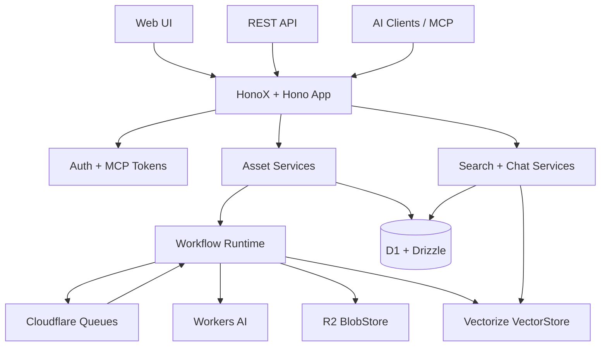

<p align="center">
  <br>
  <h1 align="center">CloudMind</h1>
  <p align="center">
    开源、Cloudflare Native、个人可控的 AI 记忆层，让你的知识可搜索、可追问、可引用。
  </p>
  <p align="center">
    <a href="https://www.typescriptlang.org/">
      
    </a>
    <a href="https://hono.dev/">
      
    </a>
    <a href="https://developers.cloudflare.com/">
      
    </a>
    <a href="https://orm.drizzle.team/">
      
    </a>
    <a href="https://vitest.dev/">
      
    </a>
    <a href="https://biomejs.dev/">
      
    </a>
  </p>
  <p align="center">
    <a href="./README.md">English</a> |
    <a href="./README.zh-CN.md">简体中文</a>
  </p>
  <p align="center">
    <a href="#功能特性">功能特性</a> .
    <a href="#为什么选择-cloudmind">为什么选择 CloudMind</a> .
    <a href="#架构">架构</a> .
    <a href="#快速开始">快速开始</a> .
    <a href="#部署">部署</a> .
    <a href="#mcp-server">MCP Server</a>
  </p>
</p>

<p align="center">
  <a href="https://deploy.workers.cloudflare.com/?url=https://github.com/evepupil/CloudMind">
    
  </a>
</p>

---

## 概览

CloudMind 是一个面向 AI 时代的 BYOC（Bring Your Own Cloud）知识系统。
它帮助你把 URL、笔记、PDF、浏览器采集内容、AI 对话沉淀到自己的
Cloudflare 账号中，再把这些内容处理成可搜索、可引用、可重处理、可被
AI 客户端调用的知识资产。

当前项目是一个单体 HonoX 全栈应用，包含 Web UI、REST API、队列驱动的
处理 workflow，以及无状态 HTTP 远程 MCP Server。默认使用 Cloudflare
D1、R2、Vectorize、Queues 和 Workers AI，同时通过端口抽象保留后续替换
基础设施的空间。

## 功能特性

| 分类 | 亮点 |
| --- | --- |
| 采集 | 通过 Web UI、REST API、MCP tools 保存文本笔记、URL 与 PDF |
| 处理 | 基于 workflow 完成规范化、摘要、分块、embedding、索引与状态收尾 |
| 搜索 | Vectorize 语义召回、D1 元数据过滤、grouped evidence、summary fallback |
| 问答 | 基于知识库证据生成带来源感知的回答 |
| 资产管理 | 资产列表、详情页、编辑、软删除、恢复、重处理、workflow 历史 |
| MCP | 面向 AI 客户端的无状态 HTTP MCP 工具面 |
| 认证 | 单用户登录、修改密码、会话中间件、MCP token 管理 |
| 基础设施 | Cloudflare D1、R2、Vectorize、Queues、Workers AI，可选 Jina Reader |
| 工具链 | Strict TypeScript、Zod、Drizzle ORM、Biome、Vitest |
| 部署 | Cloudflare Deploy Button、一键资源初始化、标准 Wrangler 部署 |

## 为什么选择 CloudMind

| | CloudMind | 托管式知识库 SaaS |
| --- | --- | --- |
| 数据所有权 | 运行在你自己的 Cloudflare 账号里 | 数据存放在厂商平台 |
| 原始资产 | 保留原文与文件，支持后续导出与重处理 | 导出形态取决于平台能力 |
| AI 记忆 | 可通过 Web UI、REST、MCP 使用 | 通常绑定在单一产品界面中 |
| 基础设施 | Serverless-first，运维成本低 | 后端实现通常不可见 |
| 迁移空间 | repository、blob、vector、queue、AI provider 都有端口边界 | 迁移依赖厂商 API |
| 检索模型 | 语义 chunks、元数据 terms、grouped evidence、来源感知问答 | 多数细节隐藏在产品体验后 |
| 可扩展性 | Feature-first TypeScript 代码结构 | 扩展点由平台决定 |

## 架构



CloudMind 把产品逻辑与基础设施细节分开：

| Port | 默认实现 |
| --- | --- |
| `AssetRepository` | Cloudflare D1 + Drizzle ORM |
| `WorkflowRepository` | Cloudflare D1 + Drizzle ORM |
| `BlobStore` | Cloudflare R2 |
| `VectorStore` | Cloudflare Vectorize |
| `JobQueue` | Cloudflare Queues |
| `AIProvider` | Cloudflare Workers AI |

这个形态服务当前 Cloudflare Native MVP，也为未来 PostgreSQL + pgvector、
S3-compatible storage、多 AI provider 留出迁移空间。

## 处理模型

资产会进入按类型划分的 workflow：

- `note_ingest_v1`
- `url_ingest_v1`
- `pdf_ingest_v1`

典型流程：

1. 创建资产元数据。
2. 持久化原始输入。
3. 创建 workflow run。
4. 规范化并持久化清洗内容。
5. 生成摘要与元数据 terms。
6. 切分 chunks。
7. 生成 embeddings。
8. 写入向量与 chunk 元数据。
9. 完成资产状态收尾。

队列消费入口在 [`app/server.ts`](./app/server.ts)，workflow 分发注册在
[`src/features/workflows/server/registry.ts`](./src/features/workflows/server/registry.ts)。

## 快速开始

```bash
git clone https://github.com/evepupil/CloudMind.git
cd CloudMind
npm install
npm run dev
```

Vite 开发服务默认地址：

```text
http://localhost:5173
```

如果需要更接近 Cloudflare Worker 的本地运行时：

```bash
npm run worker:dev
```

### 环境与绑定

CloudMind 从 [`wrangler.jsonc`](./wrangler.jsonc) 读取 Cloudflare 绑定。
应用依赖：

| Binding / Var | 用途 |
| --- | --- |
| `DB` | D1 数据库，保存资产、chunks、facets、jobs、auth、MCP tokens、workflows |
| `ASSET_FILES` | R2 bucket，保存原始内容与处理后内容 |
| `ASSET_VECTORS` | Vectorize index，保存资产 chunk 向量 |
| `WORKFLOW_QUEUE` | Queue，执行异步 workflow |
| `AI` | Workers AI，用于摘要、分类、embedding 与问答 |
| `JWT_SECRET` | 会话签名密钥 |
| `JINA_API_KEY` | 可选，用于 Jina Reader URL 抽取 |

绑定类型定义在 [`src/env.ts`](./src/env.ts)。

## 部署

### 方案 A：Cloudflare Deploy Button

使用 README 顶部的部署按钮，或打开：

```text
https://deploy.workers.cloudflare.com/?url=https://github.com/evepupil/CloudMind
```

Cloudflare 会引导你连接仓库、创建资源并部署。

### 方案 B：一键初始化资源并部署

首次部署到自己的 Cloudflare 账号时：

```bash
npm install
npm run deploy:one-click -- --prefix my-cloudmind
```

脚本会完成：

- 创建 D1、R2、Vectorize、Queue 资源
- 回写 `wrangler.jsonc` 绑定
- 应用 `drizzle/` 下的 D1 migrations
- 执行标准部署流程

只初始化资源：

```bash
npm run deploy:bootstrap -- --prefix my-cloudmind
```

### 方案 C：标准 Wrangler 部署

```bash
npm run build
npm run db:migrate:remote
npm run deploy
```

## Web 路由

| 路由 | 用途 |
| --- | --- |
| `/` | 首页 |
| `/login` | 登录 |
| `/change-password` | 修改密码 |
| `/capture` | 保存文本、URL 或 PDF |
| `/assets` | 资产列表与管理动作 |
| `/assets/:id` | 资产详情、元数据、jobs 与内容 |
| `/assets/:id/workflows` | 单个资产的 workflow 历史 |
| `/search` | 语义搜索界面 |
| `/ask` | 基于知识库的问答 |
| `/mcp-tokens` | MCP token 管理 |

## API Surface

### Ingest

- `POST /api/ingest/text`
- `POST /api/ingest/url`
- `POST /api/ingest/file`
- `POST /api/assets/:id/process`
- `POST /api/assets/backfill/chunks`

### Assets

- `GET /api/assets`
- `GET /api/assets/:id`
- `PATCH /api/assets/:id`
- `DELETE /api/assets/:id`
- `POST /api/assets/:id/restore`
- `GET /api/assets/:id/jobs`
- `GET /api/assets/:id/workflows`

### Workflows、Search、Chat、Health

- `GET /api/workflows/:id`
- `POST /api/search`
- `POST /api/chat`
- `GET /api/health`

## MCP Server

CloudMind 通过无状态 HTTP 暴露 MCP Server：

```text
POST /mcp
```

请求需要携带从 `/mcp-tokens` 页面创建的 bearer token。
`GET /mcp` 与 `DELETE /mcp` 返回 `405 Method not allowed`。

当前 MCP tools：

| Tool | 用途 |
| --- | --- |
| `save_asset` | 保存文本笔记或 URL，并触发处理 |
| `list_assets` | 按过滤条件分页列出资产 |
| `search_assets` | 执行带证据结构的语义检索 |
| `search_assets_for_context` | 按上下文 profile 执行检索 |
| `get_asset` | 按 ID 获取资产详情 |
| `update_asset` | 更新标题、摘要或来源 URL |
| `delete_asset` | 软删除资产 |
| `restore_asset` | 恢复软删除资产 |
| `reprocess_asset` | 触发资产重处理 |
| `list_asset_workflows` | 查看某个资产的 workflow runs |
| `get_workflow_run` | 获取 workflow run 详情、步骤与 artifacts |
| `ask_library` | 基于知识库快速生成 grounded answer |
| `ask_library_for_context` | 按上下文 profile 生成 grounded answer |

工具注册位于
[`src/features/mcp/server/service.ts`](./src/features/mcp/server/service.ts)，
路由位于 [`src/features/mcp/server/routes.ts`](./src/features/mcp/server/routes.ts)。

## 请求示例

创建文本资产：

```bash
curl -X POST http://localhost:5173/api/ingest/text \
  -H "Content-Type: application/json" \
  -d '{
    "title": "Cloudflare Queues notes",
    "content": "Queues drive async workflow execution in CloudMind."
  }'
```

执行语义搜索：

```bash
curl -X POST http://localhost:5173/api/search \
  -H "Content-Type: application/json" \
  -d '{
    "query": "queue-driven ingestion",
    "page": 1,
    "pageSize": 10
  }'
```

向记忆层提问：

```bash
curl -X POST http://localhost:5173/api/chat \
  -H "Content-Type: application/json" \
  -d '{
    "question": "How does CloudMind process ingested content?",
    "topK": 5
  }'
```

## 项目结构

```text
app/
  routes/                         HonoX 页面
  server.ts                       应用入口与队列消费入口
src/
  core/                           领域端口与核心契约
  env.ts                          Cloudflare 绑定类型
  features/
    assets/                       资产查询、编辑、软删除、恢复
    auth/                         登录、密码、会话中间件
    capture/                      采集 UI
    chat/                         基于证据的问答
    health/                       健康检查
    ingest/                       采集服务、PDF 抽取、AI enrichment
    layout/                       应用布局组件
    mcp/                          远程 MCP Server
    mcp-tokens/                   MCP token 管理
    search/                       检索、证据、term search
    workflows/                    workflow runtime 与定义
  platform/
    ai/                           Workers AI adapter
    blob/                         R2 adapter
    db/                           D1 schema 与 repositories
    observability/                结构化 logger
    queue/                        Cloudflare Queue adapter
    vector/                       Vectorize adapter
    web/                          URL 抽取 adapters
drizzle/                          D1 migrations
docs/                             设计说明与产品方向
tests/unit/                       Vitest 单元测试
```

## Scripts

```bash
npm run dev                 # Vite 开发服务
npm run build               # Tailwind CSS build + Vite production build
npm run preview             # 预览生产构建
npm run worker:dev          # Wrangler 本地开发
npm run worker:deploy       # deploy 别名
npm run deploy              # 构建、迁移远端 D1、部署 Worker
npm run deploy:bootstrap    # 创建 Cloudflare 资源并应用 migrations
npm run deploy:one-click    # 初始化资源并部署
npm run db:generate         # 生成 Drizzle migrations
npm run db:migrate:remote   # 应用远端 D1 migrations
npm run typecheck           # TypeScript strict check
npm run lint                # Biome check
npm run format              # Biome format
npm run test                # Vitest unit tests
```

## 测试

仓库包含以下单元测试覆盖：

- ingest services、routes、content processing、PDF extraction
- asset services 与 routes
- search services、routes、evidence、term expansion
- chat services 与 routes
- MCP routes 与工具面行为
- workflow services 与 components
- D1 repositories
- Workers AI provider
- observability logger

提交 PR 前建议执行：

```bash
npm run typecheck
npm run lint
npm run test
```

## 设计原则

- 原始资产要可靠保存，AI 派生结果可重算。
- 业务逻辑通过端口隔离，不让 D1、R2、Vectorize、Workers AI 细节散落到各处。
- 耗时处理优先进入 queue-driven workflows。
- API 与工具边界统一使用 Zod 校验输入。
- AI 输出需要可重试、可替换、可追溯来源。
- 当部分派生产物缺失时，检索和问答需要优雅降级。
- 产品功能放在 `src/features/<feature>`，基础设施适配器放在 `src/platform`。

## Roadmap

| 阶段 | 重点 |
| --- | --- |
| v0.1 | URL、文本、PDF 采集；workflows；摘要；标签；embeddings；搜索；资产详情 |
| v0.2 | 更强的问答体验、MCP 易用性、浏览器插件工作流、导出、重处理 |
| v0.3 | 更好的相关推荐、更丰富的元数据、多 AI provider、迁移准备 |

## Contributing

- 新产品模块放在 `src/features/<name>`。
- 基础设施相关代码放在 `src/platform`。
- 使用 strict TypeScript，避免 `any`。
- 行为跨 service、repository、API 或 MCP 边界时补充聚焦测试。
- 提交 PR 前执行 `npm run typecheck`、`npm run lint`、`npm run test`。

更完整的产品方向与架构约束见 [`AGENTS.md`](./AGENTS.md)。
