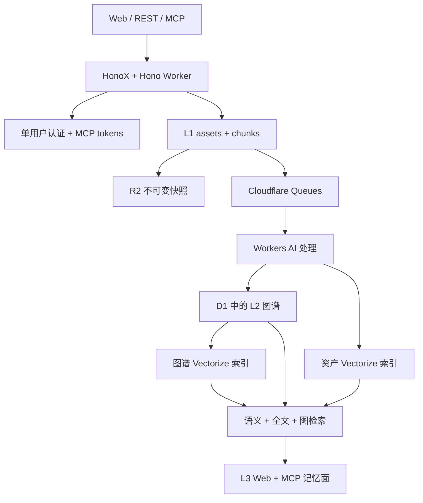

<p align="center">
  <br>
  <h1 align="center">CloudMind</h1>
  <p align="center">
    开源、用户自有、运行在个人 Cloudflare 账号中的 AI 记忆层。
  </p>
  <p align="center">
    <a href="https://www.typescriptlang.org/">
      
    </a>
    <a href="https://hono.dev/">
      
    </a>
    <a href="https://developers.cloudflare.com/">
      
    </a>
    <a href="https://github.com/evepupil/CloudMind/releases/tag/v0.3.0">
      
    </a>
    <a href="https://vitest.dev/">
      
    </a>
  </p>
  <p align="center">
    <a href="./README.md">English</a> |
    <a href="./README.zh-CN.md">简体中文</a>
  </p>
  <p align="center">
    <a href="#当前能力">当前能力</a> ·
    <a href="#架构">架构</a> ·
    <a href="#快速开始">快速开始</a> ·
    <a href="#部署">部署</a> ·
    <a href="#mcp-server">MCP Server</a> ·
    <a href="#数据主权">数据主权</a>
  </p>
</p>

---

## 概览

CloudMind 是一套 BYOC（Bring Your Own Cloud）个人 AI 记忆层。它运行在用户
自己的 Cloudflare 账号中，原始来源、结构化记忆、搜索索引和导出数据都由用户掌控。

它可以收集 URL、笔记和 PDF，提取并调和知识，通过全文、语义和知识图谱多个渠道
检索证据，还能通过 MCP 向 AI 客户端提供经过筛选的个人记忆和 Agent 工作记忆。

当前版本为 **v0.3.0**。现行 roadmap 的全部里程碑已经完成，并通过本地门禁、
GitHub Actions、生产 smoke 和 Worker 回滚演练。

## 记忆模型

CloudMind 使用三层结构：

| 层级 | 职责 |
| --- | --- |
| L1 来源层 | 不可变资产、chunks 和 R2 原始快照，是可导出的事实来源 |
| L2 语义记忆层 | D1 知识图谱，包含实体、双时间 statements、关系、来源和可选 communities |
| L3 记忆面 | Web 管理和 MCP 记忆动词，支持记住、回忆、更新、遗忘和恢复 |

每条记录还带有三个可以自由组合的维度：

```text
recordKind = library | memory
scopeId    = personal | agent
contextKey = global | project:<stable-key>
```

三个维度分别表达记录形态、记忆归属和项目上下文。单个维度内使用 OR，跨维度使用
AND，因此 Agent 可以按实际任务灵活筛选。

CloudMind 不会自动归档完整的外部会话。AI 客户端通过 `remember_agent` 写入经过
挑选的高密度记忆；用户需要保存完整资料或对话时，可以显式归档成 library asset。

## 当前能力

| 领域 | 已有能力 |
| --- | --- |
| 采集 | 通过 Web、REST 或 MCP 保存文本、URL 和 PDF |
| 处理 | 队列驱动的规范化、摘要、分块、embedding、实体提取和知识调和 |
| 检索 | Vectorize 语义召回、D1 FTS5/BM25、图检索、RRF 融合、Workers AI 重排和 MMR |
| 记忆 | 个人记忆与 Agent 记忆、全局/项目上下文、日期过滤、版本历史和来源追踪 |
| 生命周期 | 专用更新、软遗忘、恢复、确认后永久删除，以及跨存储清理 |
| Web | Observatory 工作台、资料库、搜索、问答、图谱、时间线、整合、活动和 Agent 记忆管理 |
| 数据主权 | 不可变原始快照、带校验和的完整导出、离线校验和全新资源恢复 |
| 发布 | SemVer、changelog 门禁、远端 migration 核验、生产 smoke、自动回滚和回滚演练 |
| 认证 | 单用户登录、首次强制改密、MCP token 和可复制的 AI 安装提示词 |

## 架构


```mermaid
flowchart TD
    Sources["Web / REST / MCP"] --> App["HonoX + Hono Worker"]
    App --> Auth["单用户认证 + MCP tokens"]
    App --> L1["L1 assets + chunks"]
    L1 --> R2["R2 不可变快照"]
    L1 --> Queue["Cloudflare Queues"]
    Queue --> AI["Workers AI 处理"]
    AI --> L2["D1 中的 L2 图谱"]
    AI --> AssetVectors["资产 Vectorize 索引"]
    L2 --> GraphVectors["图谱 Vectorize 索引"]
    L2 --> Retrieval["语义 + 全文 + 图检索"]
    AssetVectors --> Retrieval
    GraphVectors --> Retrieval
    Retrieval --> L3["L3 Web + MCP 记忆面"]
```

项目采用单个 HonoX 全栈应用。领域逻辑通过 repository、blob、vector、queue 和
AI provider 端口与基础设施隔离，未来可以替换 D1、R2、Vectorize、Queues 和
Workers AI。

## 处理模型

资产会进入按类型划分的 workflow：

- `note_ingest_v1`
- `url_ingest_v1`
- `pdf_ingest_v1`

一次典型处理会保存不可变来源、规范化内容、生成 chunks、向量化并写入索引、提取
图谱候选、调和当前与历史 statements，最后把资产标记为 ready。重试时会复用最早
归档的原始来源，不会覆盖它。

## 环境要求

- Node.js `>=24.18.0 <25`
- 通过 Corepack 使用 pnpm `10.21.0`
- 云端部署需要 Cloudflare 账号和 Wrangler 登录

## 快速开始

```bash
git clone https://github.com/evepupil/CloudMind.git
cd CloudMind
corepack enable
pnpm install
cp .dev.vars.example .dev.vars
```

把 `.dev.vars` 中的 `JWT_SECRET` 替换为足够长的随机值，然后初始化本地 D1 并启动
Vite：

```bash
pnpm exec wrangler d1 migrations apply DB --local
pnpm dev
```

默认开发地址为 `http://localhost:5173`。

需要通过 Wrangler 的 Worker runtime 运行时：

```bash
pnpm build
pnpm worker:dev
```

## 环境变量与绑定

| Binding / Var | 用途 |
| --- | --- |
| `DB` | D1 元数据、认证、workflows、记忆版本、图谱和审计数据 |
| `ASSET_FILES` | R2 原始来源与处理后内容 |
| `ASSET_VECTORS` | 资产 chunks 的 Vectorize 索引 |
| `GRAPH_VECTORS` | 实体和图检索的 Vectorize 索引 |
| `WORKFLOW_QUEUE` | 执行异步采集 workflow 的 Queue |
| `AI` | 用于生成、embedding、提取和重排的 Workers AI |
| `JWT_SECRET` | 必填的会话签名密钥 |
| `JINA_API_KEY` | 可选的 Jina Reader URL 抽取密钥 |

Wrangler 生成的绑定类型位于 `worker-configuration.d.ts`，应用可选变量补充在
[`src/env.ts`](./src/env.ts) 中。

## 部署

### 全新 Cloudflare 账号

首次部署前，bootstrap 脚本会创建账号专属的 D1、R2、两个 Vectorize 索引、
metadata indexes、Queue 和绑定：

```bash
pnpm install
pnpm exec wrangler login
pnpm deploy:one-click -- --prefix my-cloudmind
pnpm exec wrangler secret put JWT_SECRET
```

首次部署时会跳过生产 smoke，因为公开 URL 可能还没有创建。配置 `workers.dev` 或
自定义域名后执行：

```bash
SMOKE_BASE_URL=https://your-cloudmind.example.com pnpm release:smoke
```

首次登录使用一次性默认账号 `admin / admin`，CloudMind 会立即要求修改密码。

通用 Cloudflare Deploy Button 不适合作为全新账号的部署入口。CloudMind 需要
账号专属存储资源、metadata indexes 和必填 secret，bootstrap 脚本会明确创建这些
资源。

### 已有部署

`pnpm deploy` 会先构建应用，再执行经过核验的发布链：

```text
远端 D1 migrations
  -> 精确核验 migration
  -> 部署 Worker
  -> 生产 health、login 和 MCP 认证 smoke
  -> 部署后 smoke 失败时自动回滚 Worker
```

Bash：

```bash
SMOKE_BASE_URL=https://cloudmind.example.com pnpm deploy
```

PowerShell：

```powershell
$env:SMOKE_BASE_URL='https://cloudmind.example.com'
try {
  pnpm deploy
} finally {
  Remove-Item Env:SMOKE_BASE_URL -ErrorAction SilentlyContinue
}
```

D1 migration 只向前执行。schema 改动必须兼容上一个 Worker 版本。详细流程见
[`发布与回滚 Runbook`](./docs/runbooks/发布与回滚.md)。

## Web 路由

| 路由 | 用途 |
| --- | --- |
| `/` | Observatory 总览 |
| `/capture` | 保存文本、URL 或 PDF 来源 |
| `/assets` | 资料库列表和管理 |
| `/assets/:id` | 资产详情、来源、内容和 workflow 状态 |
| `/assets/:id/workflows` | 单个资产的 workflow 历史 |
| `/search` | 混合检索界面 |
| `/ask` | 带来源的资料库问答 |
| `/memory/agent` | Agent 记忆过滤、项目和生命周期管理 |
| `/memory/agent/:id` | Agent 记忆详情和版本历史 |
| `/memory/graph` | 知识图谱视图 |
| `/memory/timeline` | 按时间查看记忆 |
| `/memory/consolidation` | 记忆整合与维护视图 |
| `/activity` | 处理和系统活动 |
| `/mcp-tokens` | MCP token 管理、配置 JSON 和 AI 安装提示词 |
| `/login`、`/change-password` | 单用户认证 |

## API

| 领域 | Endpoints |
| --- | --- |
| 采集 | `POST /api/ingest/text`、`/url`、`/file`；`POST /api/assets/:id/process` |
| 资产 | `GET /api/assets`、`GET/PATCH/DELETE /api/assets/:id`，以及恢复、jobs 和 workflows |
| 检索 | `POST /api/search`、`POST /api/chat` |
| 记忆 Web | `GET /api/memory/graph`、`/timeline`、`/consolidation`、`/manage`、`/manage/:id` |
| 健康检查 | `GET /api/health` |
| MCP | 需要认证的 `POST /mcp`；`GET` 和 `DELETE` 返回 `405` |

## MCP Server

CloudMind 在 `POST /mcp` 提供无状态 HTTP MCP Server。请求需要携带从
`/mcp-tokens` 创建的 bearer token。

每个有效 token 都可以生成通用配置 JSON，或生成面向 Codex、Claude Code 和其他
AI 客户端的可复制安装提示词。提示词会要求 AI 配置 MCP、安装
`cloudmind-memory` Skill、验证工具列表，并禁止把 token 写入日志、仓库或长期记忆。

当前 20 个工具按职责分组：

| 分组 | Tools |
| --- | --- |
| 个人记忆 | `remember`、`recall`、`update_memory`、`forget`、`restore_memory` |
| Agent 记忆 | `remember_agent`、`recall_agent` |
| 资料库 | `save_asset`、`list_assets`、`search_assets`、`search_assets_for_context`、`get_asset`、`ask_library`、`ask_library_for_context` |
| 资产管理 | `update_asset`、`delete_asset`、`restore_asset`、`reprocess_asset` |
| 运维 | `list_asset_workflows`、`get_workflow_run` |

个人偏好和历史使用 `recall`。继续 Agent 以前的项目决策、进度、阻塞和工作记忆时，
使用 `recall_agent` 并明确传入稳定的项目 `contextKey`。查找大量来源资料时使用资料库
搜索。

工具注册位于
[`src/features/mcp/server/service.ts`](./src/features/mcp/server/service.ts)。客户端调用流程
见 [`skills/cloudmind-memory/SKILL.md`](./skills/cloudmind-memory/SKILL.md)。

## 数据主权

CloudMind 会把 D1 业务表、被引用的 R2 对象和两个向量索引导出成带版本的完整数据包，
manifest 中包含逐文件校验和：

```bash
pnpm data:export -- --output <package-directory> --remote
pnpm data:validate -- --package <package-directory>
pnpm data:restore -- --package <package-directory> --remote \
  --database <fresh-d1> --bucket <fresh-r2> \
  --asset-index <fresh-asset-index> --graph-index <fresh-graph-index> \
  --confirm-empty-target
```

恢复只接受明确命名的隔离资源，并核验数据表、FTS、外键、R2 对象和向量。执行前请阅读
[`数据导出与恢复 Runbook`](./docs/runbooks/数据导出与恢复.md)。

## 项目结构

```text
app/routes/                         HonoX 页面
app/server.ts                       HTTP、Queue 和 scheduled 入口
src/core/                           领域端口和契约
src/features/assets/                资料库和资产生命周期
src/features/ingest/                文本、URL 和 PDF 采集
src/features/search/                混合检索和图检索
src/features/memory/                图谱、记忆生命周期和 Agent Web
src/features/sovereignty/           永久删除和数据主权服务
src/features/mcp/                   远程 MCP Server
src/features/workflows/             workflow、Queue 和 scheduled consumers
src/platform/                       D1、R2、Vectorize、AI 和 Queue adapters
drizzle/                            D1 migrations
scripts/ops/                        导出、恢复和验收脚本
scripts/release/                    版本、migration、smoke、部署和回滚脚本
tests/                              单元、eval 和 Workers 集成测试
docs/模块设计/                       当前模块文档
```

## Scripts

| 命令 | 用途 |
| --- | --- |
| `pnpm dev` | Vite 开发服务 |
| `pnpm build` | 生产 CSS 和 Worker 构建 |
| `pnpm worker:dev` | Wrangler 本地 Worker runtime |
| `pnpm gate` | 配置、版本、类型、lint、测试、eval、构建、绑定和 Workers 完整门禁 |
| `pnpm eval` | 固定 25 个查询的检索回归测试 |
| `pnpm deploy:one-click` | 创建全新 Cloudflare 资源并首次部署 |
| `pnpm deploy` | 构建并执行经过核验的生产发布链 |
| `pnpm release:smoke` | 生产 health、login 和 MCP 认证 smoke |
| `pnpm release:rollback:rehearse` | 回滚到上一稳定 Worker，再恢复当前版本 |
| `pnpm data:export` | 创建带版本的完整数据包 |
| `pnpm data:validate` | 离线校验数据包 |
| `pnpm data:restore` | 恢复到明确命名的隔离资源 |

## 验证

执行与 GitHub Actions 相同的门禁：

```bash
pnpm gate
git diff --check
```

门禁覆盖 strict TypeScript、Biome、单元测试、检索 eval、生产构建、生成绑定漂移和
Miniflare D1/Queue 集成测试。

## 文档

- 产品北极星：[`docs/vision.md`](./docs/vision.md)
- 当前路线图：[`docs/roadmap.md`](./docs/roadmap.md)
- 记忆层架构：[`docs/memory-layer-architecture.md`](./docs/memory-layer-architecture.md)
- 当前模块：[`docs/模块设计/`](./docs/模块设计/)
- 发布与回滚：[`docs/runbooks/发布与回滚.md`](./docs/runbooks/发布与回滚.md)
- 导出与恢复：[`docs/runbooks/数据导出与恢复.md`](./docs/runbooks/数据导出与恢复.md)

历史路线图保存在 `docs/roadmap-archive/`，只用于查阅过去的决策。

## Contributing

- 产品逻辑放在 `src/features`，基础设施放在 `src/platform`。
- 保持 TypeScript strict，避免 `any`。
- service、repository、API、MCP 和状态变更需要补充聚焦测试。
- 实现变化时同步更新对应模块文档。
- 提交前执行 `pnpm gate`。

项目工程规范见 [`AGENTS.md`](./AGENTS.md)。
